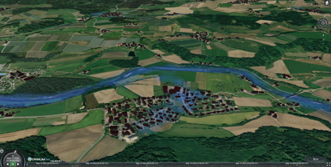

# 3D Forum Lindau 2024
## Hands-on: Developing Web 3D Applications on CesiumJS

This project is created as a showcase on how to build a 3D web application with CesiumJS. The application initializes a Cesium Viewer and may include multiple data sources such as 
- Basemaps (OSM or ArcGIS)
- Terrain (from OGC API - 3D GeoVolumes)
- 3D tiles (from OGC API - 3D GeoVolumes) 
- Additional 2D imagery layer - Flood risk (ArcGIS).

## How to Run locally
- Using Python: ` python -m http.server 80 `
- Using VSCode + Liver Server Extension

## Live Demo: 

https://3-dforum-2024-workshop.vercel.app

## Default Settings:

- **Initial View**: The application starts with a view centered at latitude 47.5728539, longitude 9.6473353, and a height of 3500.0 meters. (Near to Lindau)
- **Basemap**: Utilizes OpenStreetMap as the base imagery layer.
- **3D Tiles**: Loads 3D buildings from SmartMapping ADV basemap.de the URL `https://web3d.basemap.de/cesium/buildings-fly/root.json`.
- **Terrain**: Integrates terrain data from the URL `https://web3d.basemap.de/cesium/dgm5-mesh`.
- **Additional Imagery**: Includes an ArcGIS MapServer Imagery layer from the URL `https://tiles.arcgis.com/tiles/1lplwYilIlo008hQ/arcgis/rest/services/HighFloodRisk_ExportFeatures/MapServer`.

